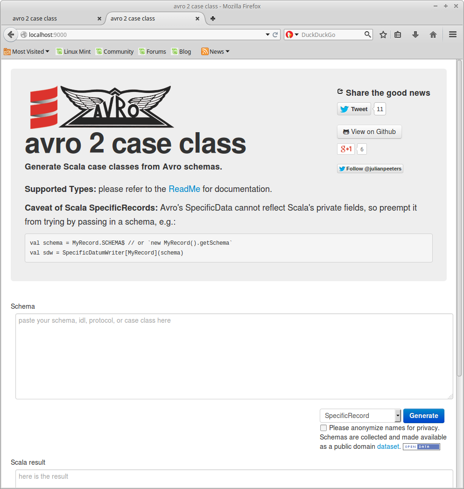

avro2caseclass
====================

Generate Scala case class definitions from Avro schemas.


Try it at: [https://avro2caseclass.herokuapp.com/](https://avro2caseclass.herokuapp.com/) (hobbyist account, so give it a sec to rev up)

[](https://avro2caseclass.herokuapp.com/)


### Supported formats

Please see the [avrohugger docs](https://github.com/julianpeeters/avrohugger) for details


### Alternative Distributions

Integrate Avro Scala code-generation into your project:
- [avrohugger](https://github.com/julianpeeters/avrohugger): Scala version of Avro SpecificCompiler and Avro-Tools
- [sbt-avrohugger](https://github.com/julianpeeters/sbt-avrohugger): Generate classes seamlessly at each compile, analogous to sbt-avro
- [avro-scala-macro-annotations](https://github.com/julianpeeters/avro-scala-macro-annotations): experimental feature, but allows for '[interactive](http://bit.ly/1TJ42IU)' code generation.


### Dataset

In the spirit of open data, input is collected and made available for download as an Avro datafile.

//TODO: dat data package manager integration


###Creating a Heroku app

Make sure that `mongo.default.uri` in `conf/appication.conf` is set to `${MONGOLAB_URI}`,
then run:

```
heroku create avro2caseclass
git push heroku master
heroku addons:create mongolab
heroku ps:scale web=1
```

### Development

To develop locally without setting up a MongoLab account, simply start a local MongoDB and point the `mongodb.default.uri` configuration key to it.

~~~bash
mkdir -p /tmp/avro2caseclass && mongod --dbpath /tmp/avro2caseclass --smallfiles
sbt run -Dmongodb.default.uri=mongodb://localhost:27017/avro2caseclass
~~~

### Credits

- based on [json2caseclass](http://json2caseclass.cleverapps.io/)
- play project based on Mironor's [example](https://github.com/Mironor/Play-2.0-Scala-MongoDb-Salat-exemple).
- depends on [avrohugger](https://github.com/julianpeeters/avrohugger)


#### Contributors:
- [Marius Soutier](https://github.com/mariussoutier)
